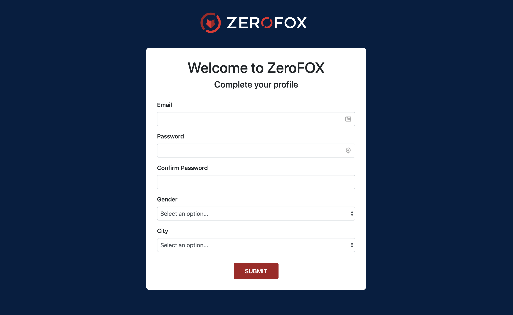

# Scenario

Estamos trabajando en el flujo de creación de usuarios y el
desarrollador encargado está de vacaciones!

Esta es un pasó critico de nuestra plataformas y lo necesitamos ASAP!!!

Sigue los requerimientos e instrucciones para completar la tarea asignada.

## Requirements
### Profile Form
1. Valida que el formulario envíe los siguientes datos:
  * Email
  * Password
  * Gender
  * City (ver extra points)
  * Un hidden field con el nombre 'referal' y el valor de 'profile_page'
2. Asegurate que todos los field tengan un label y sigan la misma estructura.
3. Todos los fields son requeridos
4. Envía el formulario a success.html usando el método GET.

### Basic Styling
Necesitamos que ese formulario se vea bien!
Trata   vea lo más parecido al diseño que nos enviaron.

1. Inserta el logo de ZeroFOX en el header `logo.svg`
2. El color de fondo del formulario debe ser `#041e42`
2. El color del botton `Submit` debe ser `#a51e23`

## Extra Points
1. Rellena el campo de ciudades
  * Usa la función `initForm` para crear las opciones de ciudades.
  * `cities` simula una respuesta de un API, limpia los resultados antes de crear las opciones.
2. Valida que los fields de passwords sean identicos antes de enviar el formulario. Puedes usar el método `handleSubmit` para esto.